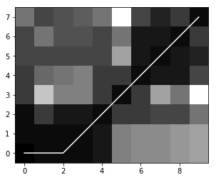

# Python 实现 Dynamic Time Warping 
动态时间扭曲被用来作为时间序列之间的相似性测量。这个包提供了两个实现:
- 算法的基本版本([见这里](https://en.wikipedia.org/wiki/Dynamic_time_warping))
- 一个基于scipy cdist的加速版(详见[https://github.com/pierre-rouanet/dtw/pull/8](https://github.com/pierre-rouanet/dtw/pull/8))

```Python
import numpy as np

# We define two sequences x, y as numpy array
# where y is actually a sub-sequence from x
x = np.array([2, 0, 1, 1, 2, 4, 2, 1, 2, 0]).reshape(-1, 1)
y = np.array([1, 1, 2, 4, 2, 1, 2, 0]).reshape(-1, 1)

from dtw import dtw

euclidean_norm = lambda x, y: np.abs(x - y)

d, cost_matrix, acc_cost_matrix, path = dtw(x, y, dist=euclidean_norm)

print(d)
>>> 2.0 # Only the cost for the insertions is kept

# You can also visualise the accumulated cost and the shortest path
import matplotlib.pyplot as plt

plt.imshow(acc_cost_matrix.T, origin='lower', cmap='gray', interpolation='nearest')
plt.plot(path[0], path[1], 'w')
plt.show()
```


累计成本矩阵(accumulated cost matrix)的结果 以及 找到的最短路径(shortest path)(白色)


## notebook 类型的其它可用的例子
(上面的代码的 notebook 格式)[https://github.com/funweb/dtw/blob/master/examples/simple%20example.ipynb]
(基于DTW + MFCC的声音比较)[https://github.com/funweb/dtw/blob/master/examples/MFCC%20%2B%20DTW.ipynb]
(简单的语音识别)[https://github.com/funweb/dtw/blob/master/examples/speech-recognition.ipynb]

## 安装
```python
# notice: It is tested on Python 2.7, 3.4, 3.5 and 3.6. It requires numpy and scipy.
python -m pip install dtw
```


参考（我得知此算法的过程）：
1 基于手机多源传感器的室内火灾行人行为识别_陈国良
2 (DTW 算法)[https://blog.csdn.net/qq_31821675/article/details/80195315]
3 https://github.com/pierre-rouanet/dtw

非常感谢他人的分享。


